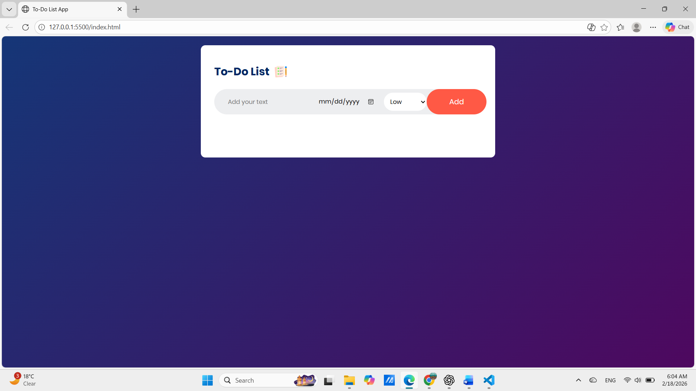

📝 Interactive To-Do List Web App

A modern, responsive, and fully interactive To-Do List web application built using core web technologies.
This project allows users to efficiently manage daily tasks with features like task prioritization, due dates, and persistent storage.

🚀 Live Demo

👉 (Add your GitHub Pages / Netlify link here)

📌 Project Overview

This application is designed to simulate a real-world task management system.

It focuses on:

Clean and intuitive UI

Interactive task management

Persistent data storage using LocalStorage

User-friendly experience

The goal of this project is to demonstrate DOM manipulation, event handling, and responsive design principles using HTML, CSS, and JavaScript.

✨ Key Features
📋 Task Management

Add new tasks

Edit existing tasks

Delete tasks

Mark tasks as completed

🔥 Task Customization

Set Priority (Low / Medium / High)

Assign Due Date

Visual task completion state

💾 Data Persistence

Tasks saved using LocalStorage

Data remains even after page refresh

🎨 UI & Design

Modern gradient background

Clean card layout

Responsive design

Interactive buttons and hover effects

⚙️ JavaScript Functionality

DOM Manipulation

Event Listeners

Dynamic Element Creation

LocalStorage Integration

Input Validation

Task State Management

🛠️ Tech Stack

HTML5

CSS3 (Flexbox, Styling, UI Design)

JavaScript (ES6)

LocalStorage API

📂 Project Structure
📁 To-Do-List-App
│── index.html
│── style.css
│── script.js
│── images/

🎯 Learning Objectives

This project demonstrates:

DOM Manipulation

Event Handling

LocalStorage Implementation

Dynamic UI Rendering

Responsive Layout Design

Clean Code Structure

📸 Screenshots

(Add your project screenshot here)

Example:

🔮 Future Improvements

Priority-based color coding

Task filtering (Completed / Pending)

Drag & Drop reordering

Dark mode feature

Backend database integration

👨‍💻 Author

Sujal Dilip Piprikar

GitHub: (https://github.com/sujalpiprikar01)

LinkedIn: (www.linkedin.com/in/sujal-piprikar-693548260)

📄 License

This project is created for educational and portfolio purposes.
